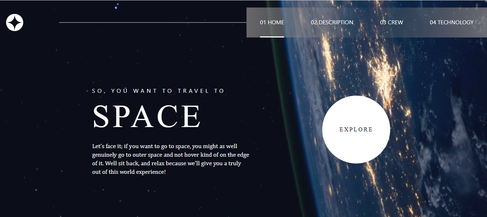
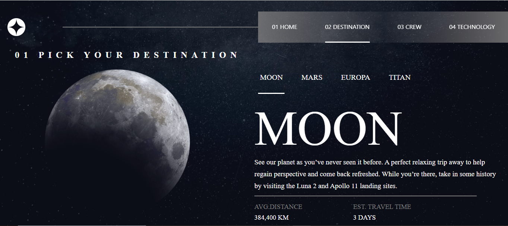
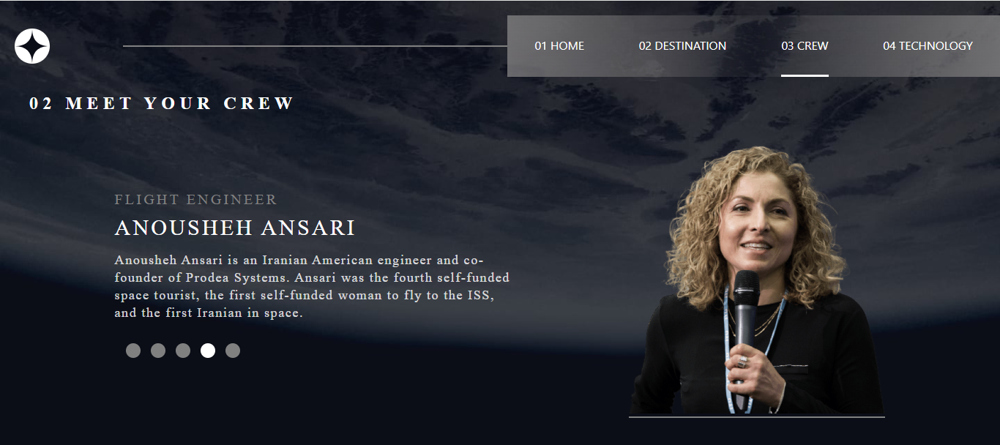
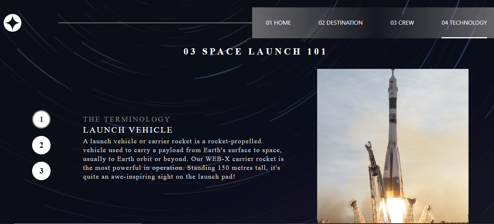
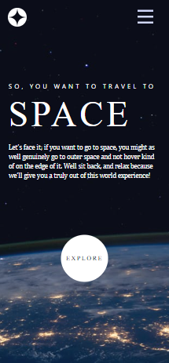
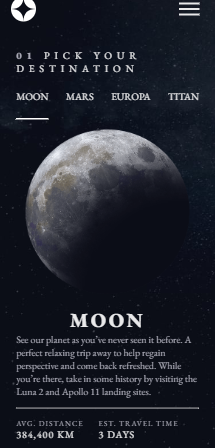
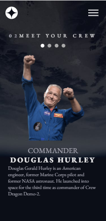
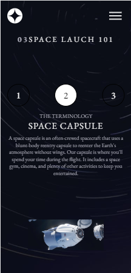

## Space tourism website 

This a challenge from  [ Frontend Mentor](https://www.frontendmentor.io/challenges/space-tourism-multipage-website-gRWj1URZ3), I accept this challenge  to increase my coding skill and exeperience. 

## Table of contents

- [Overview](#overview)
  - [The challenge](#the-challenge)
  - [Screenshot](#screenshot)
  - [Links](#links)
- [My process](#my-process)
  - [Built with](#built-with)
  - [What I learned](#what-i-learned)
  - [Continued development](#continued-development)
  - [Useful resources](#useful-resources)
- [Author](#author)
- [Acknowledgments](#acknowledgments)

**Note: Delete this note and update the table of contents based on what sections you keep.**

## Overview

### The challenge

Users should be able to:

- View the optimal layout for each of the website's pages depending on their device's screen size
- See hover states for all interactive elements on the page
- View each page and be able to toggle between the tabs to see new information

### Screenshot






   - 





### Links

- Solution URL: [space tourism repository](https://github.com/blackcat-web/space-tourism)
- Live Site URL: [Space tourism website](https://blackcat-web.github.io/space-tourism/)

## My process

### Built with

- Semantic HTML5 markup
- CSS custom properties
- Flexbox
- Mobile-first workflow
- coding from SCRATCH


### What I learned

In this project I learn a lot, I learn about more on working multi-page project and this is my first multi-page program and I know more on use of JSON and JavaScript.

To see how you can add code snippets, see below:

```html
<li class="planetItem" onclick="changePlanet(1)"><span>Mars</span></li>
```
```css
.white_circle:hover {
  border-radius: 50%;
  animation: HoverEffect 2s ease 0s infinite alternate none none;
}
@keyframes HoverEffect {
0%{
  box-shadow: 0px 0px 5px 10px #ffffff;
}
30%{
  box-shadow: 0px 0px 10px 20px #ffffff;
}
60%{
  box-shadow: 0px 0px 15px 30px #ffffff;
}
100%{
  box-shadow: 0px 0px 20px 40px #ffffff;
}
}
```
```js
function changePlanet(){
  fetch("data.json")
    .then(response => response.json())
    .then(data =>{
      // some code to assign fetched data to elements
    })
}
changePlanet(0); // default call 
```

### Continued development

proper responsive site and mobile first priority is the goal of my web development journey. I strongly believe that in future I have better understanding in [React](https://reactjs.org/), [Next.js](https://nextjs.org/) and I hope, I will not  doing coding from sratch. I will also focus on developing tools / frameworks like [angular](https://angular.io), [Django](https://djangoproject.com), [react.js](https://react.dev) and more


### Useful resources

- [W3schools](https://www.w3schools.com) - This site help me a lots while I am go deeper into web development and every time I stuck in some kind of layout problem I visit to [w3schools](https://www.w3schools.com/) and almost I get my solution.
- [Github](https://www.github.com) - Github is really a amazing platform where I use to push my repositories and it is be like **Mentos zinddagi** while using github.
- [CodePen](https://www.codepen.io) - CodePen is really cool place where I use to store my nonsense codes (._.) and It is really amazing site for me

## Author

- Frontend Mentor - [@blackcat-web](https://www.frontendmentor.io/profile/blackcat-web)
- CodePen - [@black-ninja](https://codepen.io/Black-ninja)
- Github - [@blackcat-web](https://www.github.com/blackcat-web/)

## Acknowledgments

I would Like to thank Myself and my anger because all my best works are the result of my angriness also I would like to Thank my **Lapy, Vs Code, Live Server** and at the last but not the least I would like to thanks my **Smart idiot box** my Phone.

